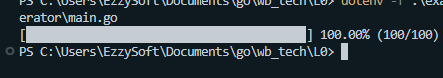

# Order Microservice L0

Go микросервис для обработки заказов: получение сообщений из **Kafka**, сохранение в **PostgreSQL**, кеширование в **Redis** + минимальный UI.


[Ссылка на видео](https://drive.google.com/file/d/1oedOxTQ2exJqhWyap8mUfvIEeTgIap-v/view?usp=sharing)


[DockerHub контейнер](https://hub.docker.com/repository/docker/ezzysoft/wb-tech-l0/general)


---

## Содержание

- [Order Microservice L0](#order-microservice-l0)
  - [Содержание](#содержание)
  - [Стек](#стек)
  - [Запуск](#запуск)
    - [Настройка окружения](#настройка-окружения)
    - [Docker Compose](#docker-compose)
    - [Локальный билд](#локальный-билд)
  - [Генерация тестовых данных](#генерация-тестовых-данных)
  - [API](#api)
  - [Переменные окружения](#переменные-окружения)

---

## Стек

- **Kafka 4.0** – три ноды (KRaft, без ZooKeeper)
- **PostgreSQL 17** – хранит нормализованные таблицы `orders`, `deliveries`, `payments`, `items` (см. `migrations/`)
- **Redis 8** – кэш за последний час + startup warmup
- **order‑service** – Go 1.24, sqlx, segmentio/kafka‑go.  
---


## Запуск

### Настройка окружения

```bash
$ git clone https://github.com/EzzySoft/order-microservice.git && cd order-microservice
$ cp example.env .env  # при необходимости отредактируйте порты/пароли
```


### Docker Compose


```bash
$ docker compose --env-file .env up -d --wait
```

### Локальный билд

```bash
# Собрать минимальный образ и запустить
$ docker build -t order-service:local .
$ docker run --env-file .env -p 8081:8081 order-service:local

# или

docker compose --env-file .env up -d --wait --build
```

> В образ входит утилита **migrate** — создает/обновляет схемы БД на старте.


---


## Генерация тестовых данных

В директории `cmd/order-generator` лежит utility для отправки `N` случайных заказов в Kafka.

```bash
$ go run ./cmd/order-generator               # localhost:19092‑94
# либо в Docker
$ docker compose exec order-service go run ./cmd/order-generator
```



---


## API

| Метод | URL            | Описание                       |
| ----- | -------------- | ------------------------------ |
| GET   | `/orders`      | Список всех `order_uid` в базе |
| GET   | `/order/{uid}` | Полные данные заказа в JSON    |

---

## Переменные окружения

| Переменная                  | По‑умолчанию                             | Описание            |
| --------------------------- | ---------------------------------------- | ------------------- |
| `DB_HOST` / `DB_PORT`       | `order-database:5432`                    | PostgreSQL          |
| `DB_USER` / `DB_PASSWORD`   | `orders` / `production-pass`             | Пара учетных данных |
| `KAFKA_BROKERS`             | `kafka-1:9092;kafka-2:9092;kafka-3:9092` | Список через `;`    |
| `REDIS_HOST` / `REDIS_PORT` | `order-cache` / `6379`                   | Redis               |
| `REDIS_PASSWORD`            | `password`                               | Пароль к редису     |

Полный список в [`example.env`](example.env).

---

